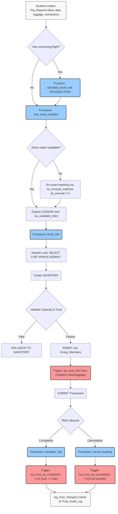

```mermaid
graph TD
    A("Student creates Trip_Request (dest, date, luggage, connection)") --> B{"Has connecting flight?"}
    
    B -- Yes --> C("Function: calculate_travel_risk (PriorityGo Flow)")
    B -- No --> D
    
    C --> D("Procedure: find_travel_buddies")
    
    D --> E{"Direct match available?"}
    
    E -- Yes --> G("Explicit CURSOR over vw_available_rides")
    E -- No --> F("En-route matching via vw_enroute_matches (is_enroute='Y')")
    
    F --> G
    
    G --> H("Procedure: book_ride")
    
    H --> I("Acquire Lock: SELECT FOR UPDATE NOWAIT")
    I --> J("Create SAVEPOINT")
    J --> K{"Validate Capacity & Trust"}
    
    K -- "Fails" --> L("ROLLBACK TO SAVEPOINT")
    K -- "Passes" --> M("INSERT into Group_Members")
    
    M --> N("Trigger: trg_seat_sync fires (Updates seats/luggage)")
    N --> O("COMMIT Transaction")
    
    O --> P{"Ride Lifecycle"}
    
    P -- "Completion" --> Q("Procedure: complete_ride")
    Q --> R("Trigger: trg_trust_on_completion (+10 trust, +1 ride)")
    
    P -- "Cancellation" --> S("Procedure: cancel_booking")
    S --> T("Trigger: trg_trust_on_cancellation (-15 trust penalty)")
    
    R --> U("log_trust_change() inserts to Trust_Audit_Log")
    T --> U
    
    classDef trigger fill:#ff9999,stroke:#333,stroke-width:2px;
    classDef proc fill:#99ccff,stroke:#333,stroke-width:2px;
    classDef state fill:#f9f9f9,stroke:#333,stroke-width:1px;
    
    class N,R,T trigger;
    class C,D,H,Q,S proc;
    class A,U state;
```
